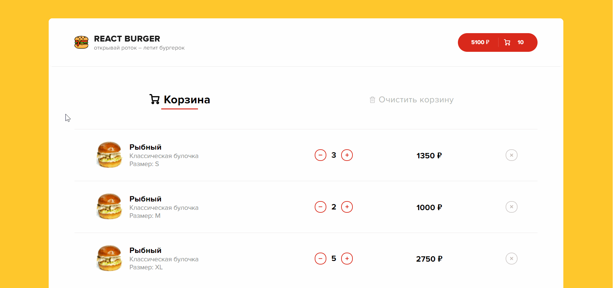

# React-burgers

**React-burgers app** - online store application for ordering burgers.

## Running application

https://react-burgers-redux.herokuapp.com/

## Application information

+ the application works on all common resolutions
+ the app is built with create-react-app
+ functional components used
+ To save the state of the basket, use ___**LocalStorage**___
+ for styles used scss, mixins, variables, animation
+ for the convenience of working with classes, the library is used ___**classnames**___
+ the library is used for runtime type checking ___**prop-types**___
+ To simulate requests to the server to receive data, the library is used ___**axios**___

## Installation
___
+ clone this repository to your computer
+ open a project in IDE
+ and:

```javascript
npm install
```

## Usage

Open two consoles and:

In the first
```javascript
npm start
```
In the second
```javascript
npm run server
```

## Functional
___
### Start page

>Overview Start page.


### Animated loading skeletons burgers

>A beautiful animation has been made to display the progress of loading burgers.


### Category selection

>Burgers are categorized and can be changed.


### Sort burgers

>Sorting burgers by price, popularity and name.


### Add burger to cart

>Each burger has 2 types of buns and 3 sizes to choose from. The price varies depending on the size of the burger. When adding, an indicator of the number of burgers added to the basket appears in the button. Also, when adding, the total quantity and price on the cart button in the header change.


### Cart page

>Overview Cart page.


### Grouping of burgers

>When adding burgers to the basket, they are grouped according to 3 criteria: type of bun, size, name. Therefore, you can clearly see which types of burgers you have added to your cart.


### Changing the contents of the basket

>To change the number of burgers of each type, there are 2 buttons to increase and decrease. When decreasing each type of burgers to one, the decrease button is deactivated. If you need to delete a group of burgers, a separate delete button is provided.


### Remove cart

>If necessary, there is a button to clear the entire basket with confirmation. When deleting, an information window appears.



### Adaptive for all permissions

>The application is adapted for all common device resolutions.

